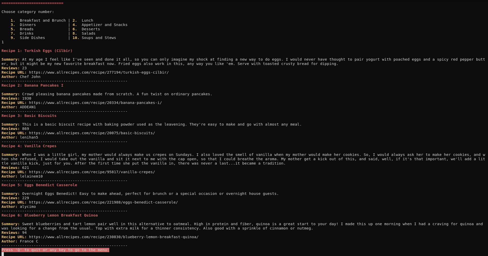

# Allrecipes Web Scraper

A Scraper of the Allrecipes website to display the top recipes by category.



## Built With

- Ruby 2.7.2
- Bundle 2.2.2
- Nokogiri 3.10
- Httparty 0.18.1
- Rspec 3.10
- Rubocop 1.6.1

## Getting Started

Follow these simple steps to get started:

### Prerequisites

- Ruby 2.7 or higher
- A terminal

### Set up

To get a local copy of this repository enter the following command in you terminal:

```
git clone https://github.com/jadx2/recipes_scraper.git
```

Or download this repository and unzip it.

### Installation

From the project's root directory execute 'bundle install' to install the necessary gems:

```
bundle install
```

### Usage

- In the project's root directory execute the 'recipes' command:

```
bin/recipes
```

- Follow the steps in the screen to get your recipes

### Run tests

Run the Rspec command in the project's root directory:

```
rspec
```

## Author

👨‍💻 **Jaim Delmar**

- Github: [@jadx2](https://github.com/jadx2/)
- Twitter: [@thecatcodes](https://twitter.com/thecatcodes)
- LinkedIn: [@Jaim Delmar](https://www.linkedin.com/in/jaim-delmar-3a45311b9/)

## 🤝 Contributing

Contributions, issues, and feature requests are welcome!

Feel free to check the [issues page](https://github.com/jadx2/recipes_scraper/issues)

## Show your support

Give a ⭐️ if you like this project!

## Acknowledgments

- Microverse
- [Allrecipes](https://www.allrecipes.com/)
